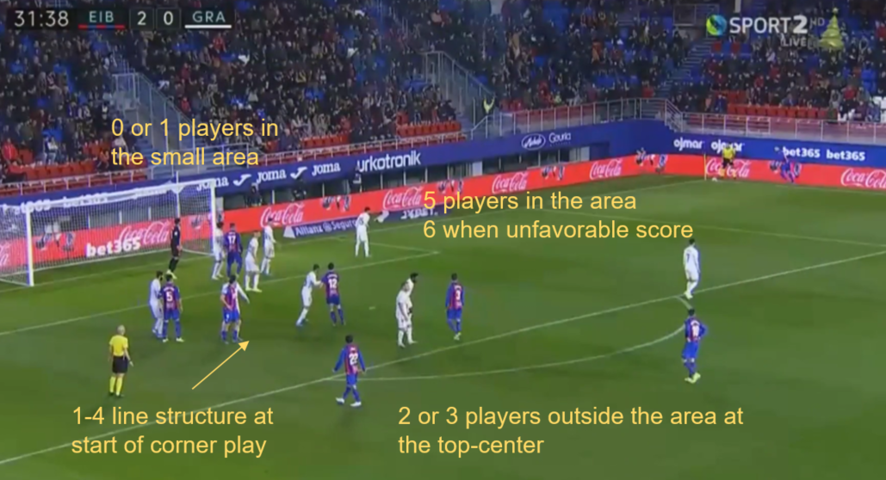
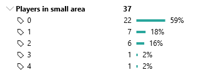
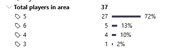
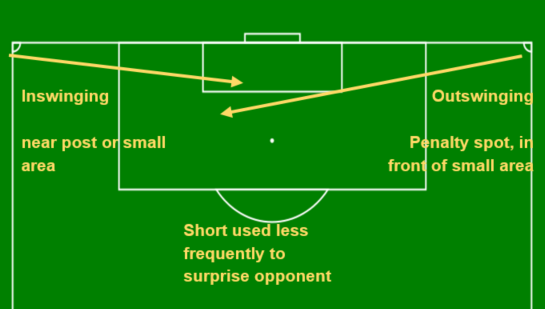
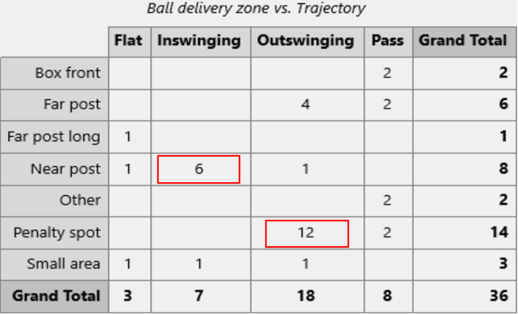

# What is this note about and who is it for?
I briefly present the structure of a typical analyst report about an __opponent's attacking corner kicks in soccer__. Then, I walk through an example of this type of report, focusing on Spanish club [SD Eibar](https://www.sdeibar.com/).

This note will interest you if:
* You are new to soccer match analysis and curious about what a report on attacking corner kicks looks like.
* You are a match analyst and are interested in similar work.
* You like the beautiful game.

This note is an expanded version of an assignment I completed as part of [FC Barcelona's Innovation Hub](https://https://barcainnovationhub.com/) course on Set Piece Analysis, which is a requirement for their Certificate in Advanced Football Tactical Analysis. In the last section you will find additional information, including the orginal powerpoint presentation, supporting videos, and tools used.

# Content and structure of a corner kick analysis report
In elite soccer, match analysts support the coaching staff with analyses of their own team and the opponents. One of their duties is to prepare reports focusing on the opponent's set pieces, of which corner kicks are one component. Corner kick analyses can be further divived in *defensive* (when the opponent is defending against a rival's corner kick) and *attacking* (when the opponent is taking the corner kick). The content and structure of these two views is similar, but here I focus only on the *attacking* corner kicks.

The content of the report will strongly depend on the specific interests of the coaching staff. The format and structure must also adapt to their needs: some coaches prefer a short video and verbal talking points; others prefer a PowerPoint presentation with embedded videos; some coaches are more quantitative than others, which affects the balance of numbers and images in the report. Finally, there should be absolute clarity on the timeline for delivering the reports to the coaching staff. It is the job of the analyst to align the content, format, and deadline of the report to the coaches' needs.

Notwithstanding the need to adapt the report to the coaches, there are recurring, fundamental aspects of attacking corner kicks that will be of interest to just about any coach in any club. Your report must identify how the particular opponent interprets these fundamentals.

## Main characteristics to observe in attacking corner kicks

* __Structure:__ How is the team organized just before the kick?
  - In parallel lines inside/outside the small area? In a "conga line" down the middle? Clustered at the near/far post?
  - How many players in the small area / penalty area?
  - How many at the top of the area / preventive coverage?
  - What are the player locations on short kicks? 
* __Trajectory:__ How is the ball kicked? 
  - Inswinging
  - Outswinging
  - Flat
  - Short/indirect
* __Delivery location:__ Where does the ball arrive on the pitch?
  - Near post
  - Far post
  - Middle of small area
  - Penalty kick spot
  - Are attempts direct or do they arise from second balls/indirect flicks?
* __Habitual kickers:__ Which players usually take corner kicks?
  - Are they right/left footed?
  - Consequences of right/left footedness and side of the corner kick on the inswinging/outswinging trajectory
* __Habitual receivers:__ Which players usually receive the ball and/or attempt a shot? 
  - What are their main characteristics?
  - Do defenders push up to attempt to score?
  * __Movements:__ How, where, and when do the players move during the kick?
  - Movement before the kick? Or only immediately before?
  - Any blocks, decoy runs, attempts to drag defenders to create space? 
* __Performance:__ Summary counts and statistics on the team's success in creating chances and scoring goals from corner kicks.
* __Patterns and correlations:__ Point out any correlations between the above characteristics. Example: inswinging kicks from the right of the goal to the near post yield more shots on goal.

## Tips on structuring the report
* __Keep it short!__ Coaches have limited time, and need to digest various reports addressing various aspects of the game, not just corner kicks. So, learn what the coaches are most interested in, focus only on those points, use short sentences, images, and __short!__ videos cohesively to convey the information: just few PowerPoint slides or Word pages will do the job.
* __Descriptive, not prescriptive:__ stay in your lane! You should focus on reporting the facts that describe the habitual behaviors of the opponent team. It is up to the coaches to decide how to use that information and prescribe training sessions and game plans. With time, as you get to know each other, you will gain the trust of the coaching staff and they will start asking you for recommendations, suggestions, etc. At first, though, stay in your lane, listen, and learn from the coaches how they use the information you give them.

# Case study - Attacking corner kicks by SB Eibar

## Initial structures
* Line-up: 1-4 line structure at the start of the corner kick play
* Number of players in the area: 1 player in the small area, 5 total players in the area, 6 when the score is unfavorable.
* Clearing and defense: 2-3 players at top of area; 1-2 in defense.

 

<!--- 

| Number of players| |
|-----|-----|
|  |  |
--->

<table>
<tr>
<td></td>
<td></td>
</tr>
</table>

## Ball trajectory and delivery location
* Mostly direct kicks with in/out swinging trajectories: short passes and flat delivery used infrequently
* Only right-footed kickers, therefore corners on the __right__ are  __inswinging__, corners on the __left__ are __outswinging__.
* __Inswinging__ delivered to the __near post__
* __Outswinging__ delivered to the __penalty zone__/__far post__ (penalty zone = central zone between the small area and the penalty spot)

## Habitual player functions: kickers, receivers, supporting
### Kickers
* __\#14 \- Fabian Orellana \(winger\)__
* __\#21 \- Pedro Leon \(winger\)__
* Only right-footed kickers
* They kick from both sides

### Receivers
<!--- 
| Receivers| |
| --- | --- |
|  |  __\# 5 \- Xavi Etxeita__ , center\-back\, 1\.86 m\, good with headers |
|  |__\# 9 \- Sergi Enrich__ \, center\-forward\, 1\.83m\, good with headers\, strong\, good at maintaining position |
|  | __\#17 \- Kike Garcia__ \, center\-forward\, 1\,86 m\, good with headers |
--->

<table>
<tr>
<td></td>
<td><b># 5 - Xavi Etxeita</b>, center-back, 1.86 m, good with headers </td>
</tr>
<tr>
<td></td>
<td><b># 9 - Sergi Enrich</b>, center-forward, 1.83 m, good with headers, strong, good at maintaining position </td>
</tr>
<tr>
<td></td>
<td><b># 17 - Kike Garcia</b>, center-forward, 1.86 m, good with headers </td>
</tr>
</table>

### Additional players in the area (drag, block) 
* __\# 6 \- Sergio A\.__
* __\# 8 \- P\. Diop__
* __\# 12 \- P\. Oliveira__

### Players at the top of the area (recover, shoot)
* __\# 22 \- Inui__
* __\# 16 \- de Blasis__
* __\# 10 \- Exposito__

## Movements
* __In general:__  players align immediately outside the small area in the penalty zone and rush in for an attempt or to drag the opponents to create space.
* __On inswinging corners:__ ball to __near post__ for direct attempt or touch to second player in small area.  __Overloading near post__ to create attempt or create space for players in small area.
 

 
THIS IS A TEST
 
<iframe width="560" height="315" src="https://www.youtube.com/embed/kMGulaVhlwI" title="YouTube video player" frameborder="1" allow="accelerometer; autoplay; clipboard-write; encrypted-media; gyroscope; picture-in-picture" allowfullscreen></iframe>

* __On outswinging corners:__ direct ball to far post/penalty zone;  __fake movements__ to the near post to create space at far post.
<!--- 
TESTING 1
 

 
TESTING 2
 

 
--->

 

__PERFORMANCE__

__Inswinging/near post__  →  __more attempts and shots__

__Outswinging/far post__  → more frequent

Habitual structure for

outswinging corners

1\-4 line structure at start of play\, both inswinging and outswinging\, but with some differences

## Performance Summary
In the following, the terminology is as follows:
* Attempt: a kick succesfully delivered to an attacking player
* Shot: an attempt that results in a shot (on goal or nearby)
* Clearance: the defense clears the ball away

* Most of the attempts are generated by deliveries to the near post or penalty zone
* Inswinging is more effective: inswinging kicks produce more attempts and goals than outwsinging.

__Inswinging/near post/penalty zone__  →  __more attempts and goals \(more effective\)__

__Outswinging/far post__  → more frequent but fewer attempts \(less effective\)

# Method and Tools

Google drive share: https://drive.google.com/drive/folders/1ZJBmPQ0b1JrL6-WgE0AGHJhG6XeouK7g?usp=sharing

